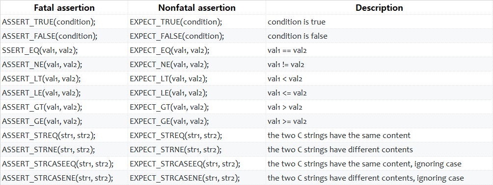
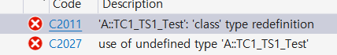
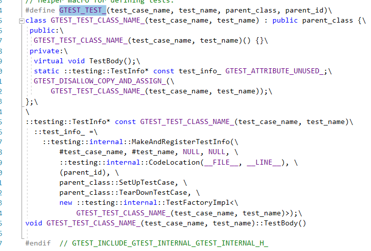
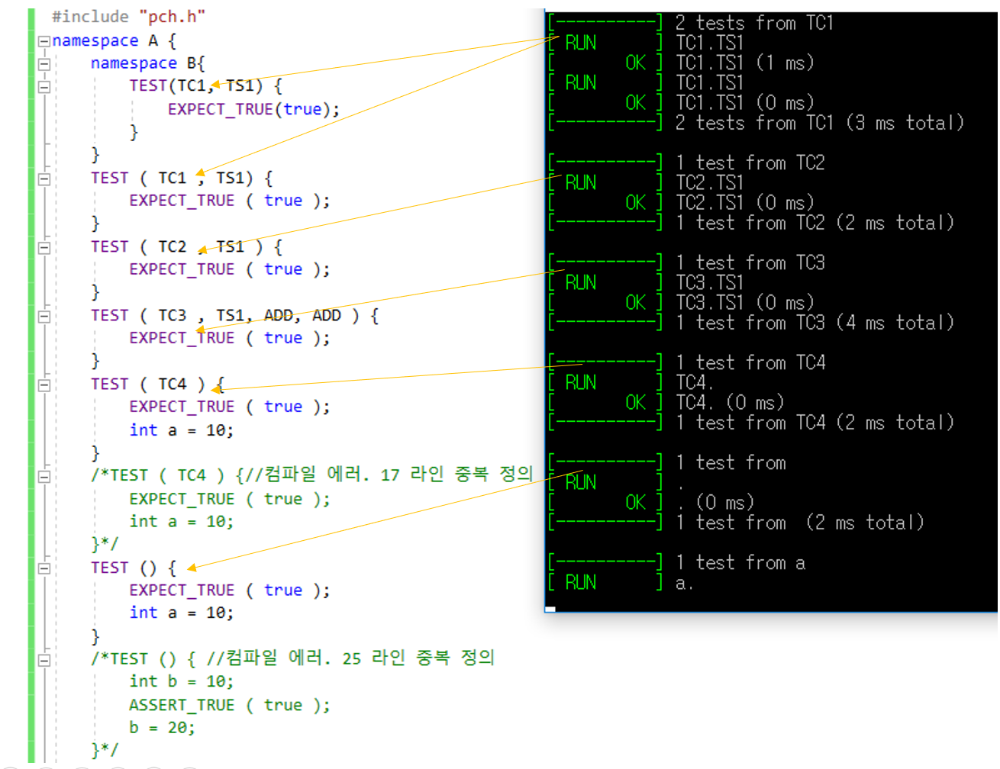
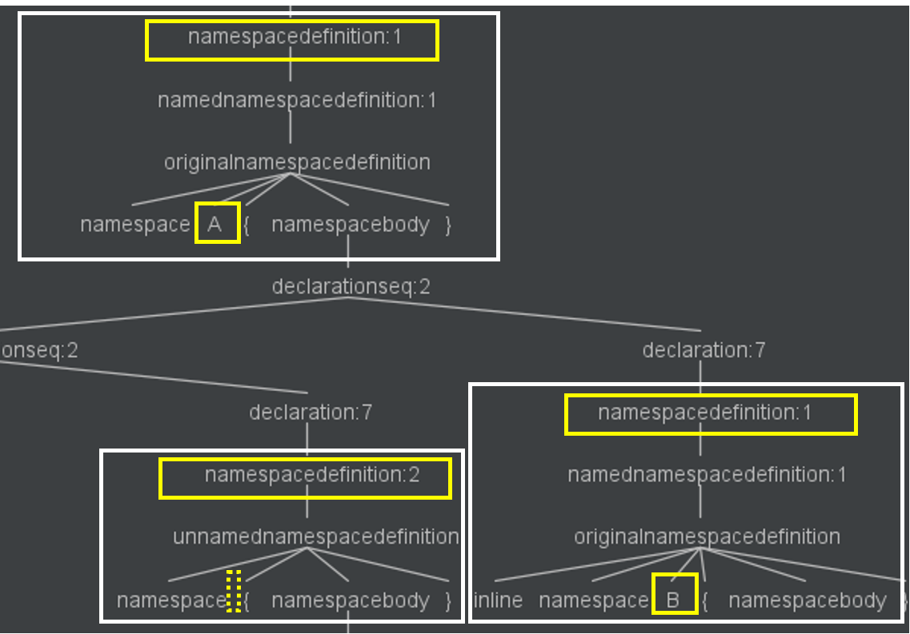
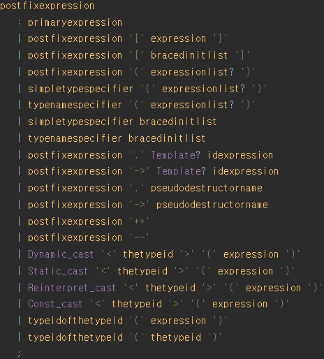
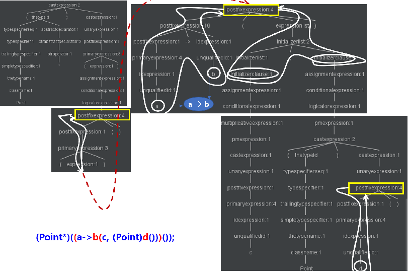

# Test Case Analyzer For C++

현재까지 SR C++ 과제 중 G-Test 외의 Test Framework 를 사용한 과제는 발견하지 못했다.
따라서 G-Test 에 특화된 Analyzer 를 구현하는 것이 효율적일 것으로 판단.

## Google Test Framework 의 특징

#### 1 .Test Case 정의 방법

* 미리 정의된 Macro 를 가지고 함수 선언 문장처럼 정의하여 Test Case 를 정의한다.
  ~~~cpp
    TEST(test_case_name, test_name){
        EXPECT_EQ(...);
    }
    TEST_F(test_case_name, test_name){
        //do something
    }
    TEST_P(test_case name, test_name){
        //do something
    }
  ~~~
* 또한 아규먼트로 TC 의 이름과 Test Suite 의 이름을 정의하도록 되어 있다. 모든 아규먼트의 개수는 2 이다.
* 위 문장들은 함수 선언문으로 정의되고 아규먼트 identifier 를 통해 Test Case, Test Suite 의 이름을 식별할 수 있다.
* 다만, 차이점이 있는 것은 아규먼트 문장이 일반 함수 문장과 다른데, 그것은 type 이 정의되지 않는다는 것이다.
* 참조
  * https://github.com/google/googletest/blob/master/googletest/docs/primer.md
  * https://github.com/google/googletest/blob/master/googletest/docs/advanced.md

#### 2. Assertion 문장

  

## 고민 필요 사항

#### 1. Test Case 식별자

* namespace, test name, testcase name 의 조합이 식별자가 되어야 함
* test name + testcase name 의 중복 정의는 문법적으로 허용되지 않으며, 그 예로 다음은 빌드 에러를 유발하는 문장이다.
  * 따라서 단일 namespace 내에서는 test name + testcase name 이 동일한 경우는 고려 대상에서 제외하여도 무방하다.
  * 또한 TEST() 등 의 선언이 클래스 원형 정의, 타 함수 선언내 정의되는 것도 문법적으로 허용되지 않고 빌드 에러를 유발하므로 이는 고려 대상에서 제외한다.
  ~~~c++
  namespace A {
  namespace B{
  	TEST(TC1, TS1) {
  		EXPECT_TRUE(true);
  	}
  }
  TEST ( TC1 , TS1) {
  	EXPECT_TRUE ( true );
  }
  TEST ( TC1, TS1) { // <---------동일 클래스 재정의로 컴파일 에러
  	EXPECT_TRUE ( true );
  }
  TEST ( TC2 , TS1 ) {
  	EXPECT_TRUE ( true );
  }
  }
  ~~~
  
  * 이는 TEST 와 같은 매크로가 class 로 정의되기 때문이다

* 또한 아래 선언 문장은 컴파일시 허용된다. 즉, 파라미터를 갖지 않을 수도 있고 무한 개의 파라미터를 가질 수 있다.
  ~~~ c
  TEST ( TC3 , TS1, ADD, ADD ) {
  	EXPECT_TRUE ( true );
  }
  TEST ( TC4 ) {
  	EXPECT_TRUE ( true );
  }
  TEST (){
  }
  ~~~

   

* Test 실행시의 Test Case 그룹핑은 아래와 같다
  * Test Case 이름이 1차 기준이고 Test Name 이 2차 기준이다
  * Test Name 이 없어도 관계 없고 파라미터가 1개도 없어도 동작은 한다

  

* namespace 은 여러 유형(inline, unanimous) 이 존재한다. 또한 계층적 정의가 가능하다
  * 이에 대한 문법은 모두 namespace definition 노드에서 시작하고 그 자식 노드에서 구분된다
  * 그러나 namespace definition 노드를 포함한 하위 노드들은 식별자를 별도의 노드로 취그하지 않아 이는 문자열 처리를 해야 한다
  ~~~
  namespace A{
     TEST(A, a){
     }
     namespace {
        TEST (B,b){
        }
     }
     inline namespace B{
     }
  }
  ~~~
* 위 구문에 대한 추상 구문 트리는 아래와 같다

  

#### 2. 함수 바디 내에서의 함수 호출 식별 -> 추후 Call Graph 필요, 근간이 될 것임

* 함수 호출은 postfix expression 의 하나의 유형으로 으로 정의되고, 다음의 구문 특징을 갖는다.
  * () 연산자를 갖는다. () 연산자는 expression list 를 갖을 수 있다.
  * () 연산자 앞에는 postfix expression 이 앞선다.
  * 문법 정의는 아래와 같다.

    

  * 따라서 추상 구문 트리 순회 규칙은 아래와 같다.
    * 함수 호출 형식의 postfix expression 을 만나면,
    * 첫 번째 자손(postfix expression)을 루트로 하는 서브 트리를 DFS 로 순회한다. 단, 함수 호출 형식의 postfix expression 을 만다면 이는 단말 노드로 간주한다
      * id expression 을 만나면 그 노드의 text 값을 저장한다. (현재는 unqualified id 만을 분석하고 qualified id 는 분석 대상에서 제외한다)
      * 순회 도중 또 다른 id expression 을 만나면 text 값을 덮어쓴다.
      * 순회를 마치면 최근 id expression 의 값을 함수 호출 구문의 식별자로 정의하고, 없는 경우 익명으로 처리한다
    * 함수 호출 구문이 expression list 를 '(' 와 ')' 사이에 그 자식으로 갖는 경우,
      * expression list 를 루트로 하는 서브 트리를 DFS 로 순회한다. 단, 함수 호출 형식을 갖는 postfix expression 은 단말노드로 간주한다.
        * initialize clause 노드를 만나면 이를 단말 노드로 간주하며 occurrence 를 카운트 한다.
        * 순회를 마치면 initialize clause 노드의 occurrence 를 해당 함수 호출 구문의 파라미터 개수로 정의한다.
        
    

#### 3. 사용자 정의 TC 정의 매크로

#### 4. 사용자 정의 Assertion 함수 정의
