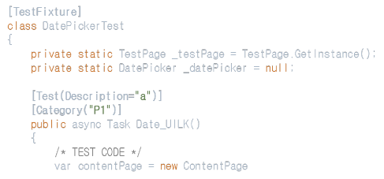

## 과제 독립적 (언어 의존적) 분석기 구조 개발

* 과제 별 X 과제 내 사용 언어 별 분석기를 개발하는 것은 너무 큰 오베헤드이다.
* 작년 기준 과제는 30 여개 남짓이고 타이젠 과제의 경우 4개 언어를 사용한다. 이 경우 우리는 120 개의 Analyzer 클래스를 만들어야 한다.
* 이는 구현의 문제만이 아니라 120개의 클래스를 과제의 기준이 변경되거나 할 때마다 수정을 해야 하는 유지보수의 문제이다.
* 물론 하나의 만능 분석기로 모든 케이스를 핸들링한다면 좋겠지만 그런것은 없다.
* 현재로서 가장 이상적인 방법은 과제별 Variation Point 를 식별하고 이를 모듈화하여 언어별로 분석기를 만드는 것이다.
* 여기서의 핵심은 과제별 Variation 을 어떻게 모듈화하여 Analyzer 내에서 은닉화 시키는 것이다.

### 과제별 Variation Point

* 같은 언어를 사용한다고 하더라도 Test Case 를 정의하는 방식이 과제별로 다르고 이는 특히 과제에서 사용하는 Test Framework 에 의존적이다
* 사례 - 1
    ~~~c
    // 과제#1
    // network_test.c
    #include "assertion.h" // in-house test framework
    #include "network.h"
    
    int connect_server_test_positive_001(){  // ^(.)+(_test)(_positive|_negative)(_)(.)+$" ??
          int handle = register(..);
          assert_equals(handle, 1);
    }
    
    //과제#2
    // network_test.cc
    #include "asserts.h"    // in-house test framework
    #include "network_manager.h"
    
    int connect_server_test_p_001(){ // 앞선 test case 명명 규치과는 다르다
        int handle = register(..);
        assert_true(handle == 1); // assert_equals 미지원
    }
    ~~~
* 사례 - 2
    ~~~c#
    //과제#1
    [TestCase]       // TestCase 임을 명시
    [Category("P1")] // positive TC, others (P2, P3, P4)negative TC
    public void ConnectNetwork_Test{
            Assert.That(...);      // N-Unit Lite
    }
    
    //과제 #2
    [Test]       // TestCase 임을 명시
        [Category("P1")] // nositive TC, others (P2, P3, P4) positive TC
        public void ConnectNetwork_Test{
                Assert.That(...);      // N-Unit full version
        }
    ~~~
* 즉, Test Case 를 식별하는 규칙 (식별 문자열, 식별자 기술 위치, 식별 문자열 패턴 매칭 방법) 과 Test Framework 에서 제공하는 Assertion Expression 토큰 정보를 Analyzer 에서 분리하면 가능하다
* 이는 Test Case 메타 정보 스키마 모듈 (schema package) 이 이 역할을 담당하고 Analyzer 모듈 (Analyzer 클래스) 과의 연결은 Helper 모듈 (Helper 클래스) 가 담당한다
* 특히 SCTestCase 클래스가 가장 핵심이다

  | 모듈                 | 작성 기준  | 예                                                     |  비고   |
  |:--------------------|:----------|:-------------------------------------------------------|:----|
  | 과제 정보 스키마     | 과제별    | com.samsung.tcm.schema                                 |     |
  | Test F/W 정보 스키마 | FW 별     | com.samsung.tc.schema.assertion                        |     |
  | 분석기               | 언어별    | com.samsung.tcm.analysis.tizen.CSharpTestCaseAnalzyer  |   fully 검증되지 않아 현재는 Tizen 으로 몀칭 정하고 추후 common 으로 올림  |
  | 매개자               | 언어별    | com.samsung.tcm.analysis.tizen.CSharpTestCaseHelper    |    상동 |

### Test Case 식별 규칙 모듈화

* TC 스키마 모듈 [readme](../../schema/readme.md) 참고

### Test Framework 의 모듈화

* FW 스키마 모듈 [readme](../../schema/assertion/readme.md)

### [참고] 분석기의 일반 흐름 분석

* 여기서의 흐름은 문법에 정의된 구문 트리 노드 간의 부모 자식 관계를 의미하고 이 관계 정의 흐름을 리스너나 비지터가 순회하는 것이다
* 예를 들어 아래와 같은 코드에서 메서드를 대상으로 정의된 Test , Category 어트리뷰트를 분석하고 class 를 대상으로 정의된 TestFixture 는 분석하지 않도록 하기 위해서는

    

* 아래와 같은 C# 언어에서 어트리뷰트가 사용되는 모든 구문 문법 룰을 인지해야 한다.

* C# 의 어트리뷰트는 아래와 같은 구조를 갖는다

    

  * 어트리뷰트들(attributes)는 하나 이상의 attribute section 으로 구성되고
  * attribute section 은 '[' 와 ']' 사이에 선택 요소인 attribute target 과  attribute list 로 구성된다
  * attribute list 는 콤마로 구분되어 여러개의 attribute 가 올 수 있다
  * 하나의 attribute 는 attribute 이름과 '(' 과 ')' 사이의 attribute argument 로 구성되고 attribute argument 는 생략 가능하다
  * 예를 들명 아래와 같다
    ~~~C#
    [Foo(typeof(int)), Bar(typeof(decimal), MessageTemplate="Bar")]
    ~~~

* C# 에서 attribute 가 올 수 있는 구문은 다양하다. 위 예제에서는 메서드가 아닌 모든 경우를 무시하도록 하면 되는데

  ~~~antlrv4
  type_declaration
  	: attributes? all_member_modifiers?
        (class_definition | struct_definition | interface_definition | enum_definition | delegate_definition)
    ;
  type_parameter
  	: attributes? identifier
    ;
  class_member_declaration
  	: attributes? all_member_modifiers? (common_member_declaration | destructor_definition)
    ;
    
  # 이 외에도 수 많은 케이스가 존재한다
  ~~~
* 이는 class_member_declaration 노드 방문시 플래그를 설정하고 attribute 노드 방문시 이 플래그가 참인 경우만 분석하도록 하면 된다. 코드 세그먼트는 아래와 같다
  ~~~java
     @Override
      public void enterClass_member_declaration(CSharpParser.Class_member_declarationContext ctx) {
          super.enterClass_member_declaration(ctx);
  
          needCheckAttribute = false;
  
          CSharpParser.Common_member_declarationContext cmdCtx = ctx.common_member_declaration();
          if (cmdCtx == null) return;
  
          // @ VOID method_declaration
          if (cmdCtx.method_declaration() != null) {
              needCheckAttribute = true;
              return;
          }
  
          // @ typed_method_declaration
          CSharpParser.Typed_member_declarationContext typed_member_declarationContext = cmdCtx.typed_member_declaration();
          if (typed_member_declarationContext != null) {
              if (typed_member_declarationContext.method_declaration() != null)
                  needCheckAttribute = true;
          }
      }
  
      @Override
      public void enterAttribute(CSharpParser.AttributeContext ctx) {
          super.enterAttribute(ctx);
          if (!needCheckAttribute) return; // 그 외의 모든 attribute 는 분석하지 않는다
  ~~~

