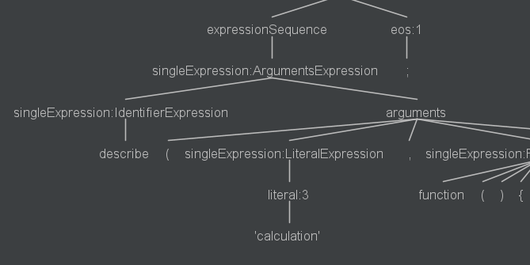

# Features and Design Decisions

There are three major features :

* Test Case Identification
* Test Case Group Identification
* Analyze identified test cases  : loc, assertion(#), complexity

The features depends on test frameworks (jasmine, mocha, in-house, etc)
It's not possible support all the test frameworks.
The three test frameworks (jasmine, mocha, in-house) will be supported

**Jasmine and Mocha**

* Identification
  * function call + ( function declaration or function declaration in function call)
    * test case name     : parameter string @ function call
    * test case function : function declaration
* Grouping
  * For only Jasmine and BDD style Mocha
  * function call
    * test group : parameter string @ function call
~~~
    // angular.js test case example
    // https://github.com/angular/angular.js/blob/master/test/ngMock/angular-mocksSpec.js
     describe('$log', function() {
        angular.forEach([true, false], function(debugEnabled) {
          describe('debug ' + debugEnabled, function() {
            beforeEach(module(function($logProvider) {
              $logProvider.debugEnabled(debugEnabled);
            }));
    
            afterEach(inject(function($log) {
              $log.reset();
            }));
    
            it('should skip debugging output if disabled (' + debugEnabled + ')', inject(function($log) {
                $log.log('fake log');
                $log.info('fake log');
                $log.warn('fake log');
                $log.error('fake log');
                $log.debug('fake log');
                expect($log.log.logs).toContain(['fake log']);
                expect($log.info.logs).toContain(['fake log']);
                expect($log.warn.logs).toContain(['fake log']);
                expect($log.error.logs).toContain(['fake log']);
                if (debugEnabled) {
                  expect($log.debug.logs).toContain(['fake log']);
                } else {
                  expect($log.debug.logs).toEqual([]);
                }
              }));
          });
        });
~~~

