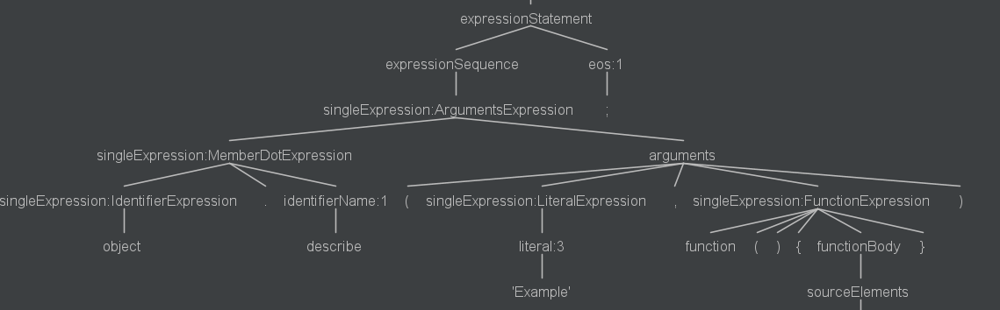

# Basic JavaScript Semantics

## Function Call : One type of 'Argument Expression'

~~~
            object.describe('Example', function() {
              describe('calculation', function() {
                it('1+1 should be 2', function(done) {
                  fs.readFile('example.txt', function(err, data) {
                    done();
                  });
                });
              });
            });
~~~

## Function Expression

## Function Declaration