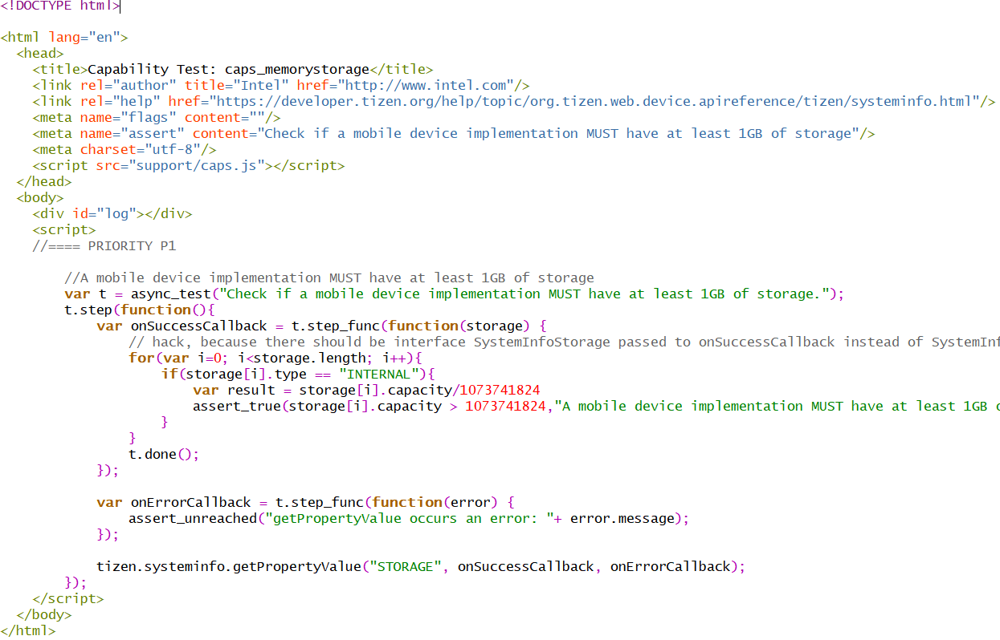

# Requirements Analysis For JavaScript Test Cases

## Test Frameworks

* references : https://raygun.com/blog/mocha-vs-jasmine-chai-sinon-cucumber/

### 1. Mocha Framework

* This framework is frequently used at npm projects
* Three types of test pattern are supported : BDD, TDD, EXPORT.
* For each style, the way to define a test case is different.
    * BDD Style : JavaScript Only
      * defining a test case with 'it()', and its 1st arg is the name of a test case
      * grouping and categorizing test cases with 'describe()'
          ~~~
            var assert  = require('assert')
                fs = require('fs');
            
            describe('Example', function() {
              describe('calculation', function() {
                it('1+1 should be 2', function(done) {
                  fs.readFile('example.txt', function(err, data) {
                    done();
                  });
                });
              });
            });
            
            // the above statements can be written like the below
            function testSuite_calculation(){
               describe('calculation', testCase_ShouldBeTwo);
            }
            function testSuite_example(){
               describe('calculation', testSuite_calculation);
            }
            function testTarget(done){
               fs.readFile('example.txt', function(err, data) {
                  done();
               });               
            }
            function testCase_ShouldBeTwo(){
               it('1+1 should be 2', testTarget);
            }
            describe('Example', testSuite_example);
          ~~~
    * EXPORT Style : JavaScript + JSON
      * defining a test case with a function object with the string key
      * grouping and categorizing test cases with json data structure
        ~~~
        module.exports = {
          
          // TDD style pre/post conditions
          before: function() {
            // excuted before test suite
          },
          after: function() {
            // excuted after test suite
          },
          
          // defining a test case with its grouping and categorizing criteria
          'exports style': {
            '#example': {
              'this is a test': function() {
                // write test logic
              }
            } 
          }
        };
        ~~~
    * TDD Style : JavaScript
      * defining a test case with test(), the 1st arg is its name
      * grouping and categorizing test cases with suite() and its declaration sequence
        * suite a > test #1 > test #2 : a has two test cases, #1 and #2
      ~~~
        suite('Qunit');
        
        test('#example', function(){
        });
        
        suite('Qunit part 2');
        
        test('#example 2', function(){
        });
      ~~~
* External assertion libraries can be used : node.js default, should.js, expect.js, chai, better-assert, unexpected
  * node.js default : https://nodejs.org/api/assert.html
    ~~~ javascript
    assert(value[, message]) // declare the value is true
    // Need var assert = requires('assert');
    assert.deepEqual(actual, expected[, message]) 
    assert.deepStrictEqual(actual, expected[, message])
    assert.doesNotReject(asyncFn[, error][, message])
    assert.doesNotThrow(fn[, error][, message])
    assert.equal(actual, expected[, message])
    assert.fail([message])
    assert.fail(actual, expected[, message[, operator[, stackStartFn]]])deprecated
    assert.ifError(value)
    assert.notDeepEqual(actual, expected[, message])
    assert.notDeepStrictEqual(actual, expected[, message])
    assert.notEqual(actual, expected[, message])
    assert.notStrictEqual(actual, expected[, message])
    assert.ok(value[, message])
    assert.rejects(asyncFn[, error][, message])
    assert.strictEqual(actual, expected[, message])
    assert.throws(fn[, error][, message])
    ~~~
  * should.js : http://shouldjs.github.io/
    ~~~
    // TBA
    ~~~
  * expect.js : https://github.com/Automattic/expect.js
    * start with expect()
    * and ends with ok(), be(), a(), an(), match(), contain(), length(), empty(), property(), key/keys(), throw/throwException/throwError(), withArgs(), within(), greaterThan/above(), lessThan/below(), fail()
    ~~~
    expect(1).to.be.ok();
    expect(true).to.be.ok();
    expect({}).to.be.ok();
    expect(0).to.not.be.ok();
    
    expect(1).to.be(1)
    expect(NaN).not.to.equal(NaN);
    expect(1).not.to.be(true)
    expect('1').to.not.be(1);
    
    expect({ a: 'b' }).to.eql({ a: 'b' });
    expect(1).to.eql('1');
    
    // typeof with optional `array`
    expect(5).to.be.a('number');
    expect([]).to.be.an('array');  // works
    expect([]).to.be.an('object'); // works too, since it uses `typeof`   
    // constructors
    expect([]).to.be.an(Array);
    expect(tobi).to.be.a(Ferret);
    expect(person).to.be.a(Mammal);
    
    expect(program.version).to.match(/[0-9]+\.[0-9]+\.[0-9]+/);
    
    expect([1, 2]).to.contain(1);
    expect('hello world').to.contain('world');
    
    expect([]).to.have.length(0);
    expect([1,2,3]).to.have.length(3);
    
    expect([]).to.be.empty();
    expect({}).to.be.empty();
    expect({ length: 0, duck: 'typing' }).to.be.empty();
    expect({ my: 'object' }).to.not.be.empty();
    expect([1,2,3]).to.not.be.empty();
    
    expect(window).to.have.property('expect')
    expect(window).to.have.property('expect', expect)
    expect({a: 'b'}).to.have.property('a');
    
    expect({ a: 'b' }).to.have.key('a');
    expect({ a: 'b', c: 'd' }).to.only.have.keys('a', 'c');
    expect({ a: 'b', c: 'd' }).to.only.have.keys(['a', 'c']);
    expect({ a: 'b', c: 'd' }).to.not.only.have.key('a');
    
    expect(fn).to.throw(); // synonym of throwException
    expect(fn).to.throwError(); // synonym of throwException
    expect(fn).to.throwException(function (e) { // get the exception object
      expect(e).to.be.a(SyntaxError);
    });
    expect(fn).to.throwException(/matches the exception message/);
    expect(fn2).to.not.throwException();
    
    expect(fn).withArgs(invalid, arg).to.throwException();
    expect(fn).withArgs(valid, arg).to.not.throwException();
    
    expect(1).to.be.within(0, Infinity);
    
    expect(3).to.be.above(0);
    expect(5).to.be.greaterThan(3);
    
    expect(0).to.be.below(3);
    expect(1).to.be.lessThan(3);
    
    expect().fail()
    expect().fail("Custom failure message")
    ~~~
* Related articles :
  * https://mochajs.org
  * https://qvil.github.io/javascript/mocha-unit-test/
  * http://jeonghwan-kim.github.io/mocha/
  * https://blog.outsider.ne.kr/770
  * https://stackoverflow.com/questions/7513645/how-do-i-expose-function-from-anonymous-self-invoking-function

### 2. Jasmine Framework

* https://github.com/angular/angular.js/tree/master/test

### 3. Tizen In-House Test Framework

#### 3.1 Framework for Web API TCT

* A test case for an web api is written in JavaScript at "script" tag in a html
* A html file has only one "script" tag and the script tag has only one test case
* The list of html files are described in a xml file for each test project. The general structure of test project likes the below :
  ~~~
  api
      --- mobile
                 --- tct-capability-tests
                                          --- tests.xml
                                          --- tests.full.xml
                                          --- resources
                                                       --- testharness.js  // assert & test functions
                                          --- capability
                                                       --- support
                                                                  --- caps.js // might be additional assert & test functions
                                                       --- caps_displayresolution.html // a test case file
                                                       --- caps_inputKeyboard.html     // a test case file

                 --- tct-deprecatedapi-tizen-tests // same structure with the above
      --- tv        // same structure with the above
      --- ivi       // same structure with the above
      --- wearable  // same structure with the above                 
  ~~~
* There are two xml files for each test project, one (tests.full.xml) is for full tc list and the other(tests.xml) is ??
* A tc list xml file defines a test suite that contains relevant test cases with their identifier and relative file path.
  ~~~xml
  <!-- api\ivi\tct-filesystemapi-w3c-tests\tests.xml-->
  <?xml version="1.0" encoding="UTF-8"?>
  <?xml-stylesheet type="text/xsl" href="./testcase.xsl"?>
  <test_definition>
    <suite category="W3C/HTML5 APIs" name="tct-filesystemapi-w3c-tests">
      <set name="FileAPIDirectoriesAndSystem" type="js">
        <testcase component="W3C_HTML5 APIs/Storage/File API: Directories and System" execution_type="auto" id="DirectoryEntry_createReader_exist" purpose="Check if DirectoryEntry.createReader exists">
          <description>
            <test_script_entry>/opt/tct-filesystemapi-w3c-tests/filesystemapi/DirectoryEntry_createReader_exist.html</test_script_entry>
          </description>
        </testcase>
  ~~~
* For each project, several test-harness set is predefined. A test harness defines test functions and assert functions.
* There are three types of test functions : synchronous test, asynchronous test and promise test. (Need check for each test harness file for each project. There might be differences among projects)
   ~~~javascript
   // api\ivi\tct-filesystemapi-w3c-tests\resources\testharness.js
   function test(func, name, properties)
   function async_test(func, name, properties)
   function promise_test(func, name, properties) 
   ~~~
* There are 9 types of assert functions :
   ~~~javascript
   // api\ivi\tct-filesystemapi-w3c-tests\resources\testharness.js   
   function assert(expected_true, function_name, description, error, substitutions)
   function assert_true(actual, description)
   function assert_false(actual, description)
   function assert_equals(actual, expected, description)
   function assert_not_equals(actual, expected, description)
   function assert_in_array(actual, expected, description)
   function assert_object_equals(actual, expected, description)
   function assert_array_equals(actual, expected, description)
   function assert_approx_equals(actual, expected, epsilon, description)
   ~~~
## Test Project Examples

### 2. Tizen Examples

#### 2.1 Tizen Test Cases

**Test Projects**

| Test Projects    | URL                                                               |
|:-----------------|:------------------------------------------------------------------|
| TCT - Web API    | git clone https://review.tizen.org/gerrit/p/test/tct/web/api      |
| TCT - Behavioral | git clone https://review.tizen.org/gerrit/p/test/tct/web/behavior |
| Web UI F/W       | git clone https://review.tizen.org/gerrit/p/test/tct/web/uifw     |

**TCT Web API Project**

**TCT Behavioral Project**

**Web UI F/W Project**

#### 2.2 Code Example

